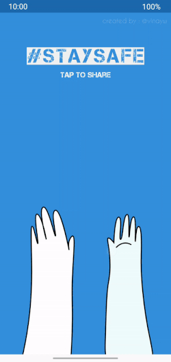
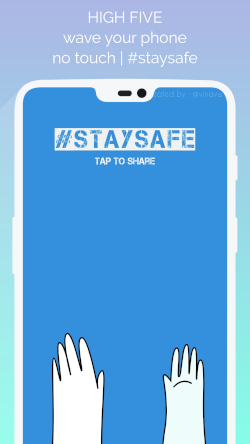

## ⬇️ Download
[][google-play-link]

## 🤔 How it works

Virtual high-fives are the new hand shakes!

High five ✋ with others by waving 👋 your phone at them.

The app plays the good-ol sound of how a real high-five sounds when you do!

PS: This works similar to [Sheldon's 'whip' app.](https://www.youtube.com/watch?v=G1RZwOlSg5o)

## 📷 Demo

 



## 👷🏼 Build
- provide actual values in the app `build.gradle` file for the keystore 
```
            storeFile file($keystore_ala_storeFile)
            storePassword $keystore_ala_storePassword
            keyAlias $keystore_ala_keyAlias
            keyPassword $keystore_ala_keyPassword
```

## 👬 Contribution

- Report issues, Open pull request with improvements.
- If you feel compelled, I'd love if you spread the word!
- Reach out with any feedback 
- Buy me a beer [](https://www.paypal.me/vinaywadhwa) (app is free to use + no ads etc)

## 🏅 License

[](https://creativecommons.org/licenses/by/4.0/)


[google-play-link]: https://play.google.com/store/apps/details?id=com.vwap.hi5&referrer=utm_source%3DGitHub%26utm_campaign%3DREADME
